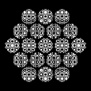

# Plugin: Hex Macro Cell (`HexMacroCellRenderer`)

The **hex macro cell** plugin renders a hexagonal aperture tiled with many small
sub-zone-plates on a triangular lattice.  All sub-elements share a common image
plane so they constructively project the same focal spot — but each sub-element
has its own off-axis angle because it sits at a different position within the
macro hex.

This design is used for **projection optics** where a larger aperture is needed
than a single small zone plate would allow, while keeping the outer-zone width
(and therefore the required printer resolution) manageable.

## Parameters

| Parameter | Unit | Description |
|-----------|------|-------------|
| `macroRadiusMm` | mm | Circumscribed radius (centre → vertex) of the outer hexagon |
| `subDiameterMm` | mm | Diameter of each sub-zone-plate |
| `subPitchMm` | mm | Centre-to-centre spacing of sub-elements on the hex lattice (≥ `subDiameterMm`) |
| `focalLengthMm` | mm | z-distance from macro plane to common image plane |
| `targetOffsetXmm` | mm | X offset of the common focal target from the macro-cell centre |
| `targetOffsetYmm` | mm | Y offset of the common focal target from the macro-cell centre |
| `wavelengthNm` | nm | Design wavelength |
| `dpi` | dots/inch | Printer resolution |
| `maskType` | — | `BINARY_AMPLITUDE` or `GREYSCALE_PHASE` |
| `polarity` | — | `POSITIVE` or `NEGATIVE` |

## Example image

### On-axis hex macro cell (15 mm radius, 5 mm sub-elements)



The hexagonal outline is clearly visible; each sub-zone-plate inside focuses
toward the same on-axis point 500 mm away.

## Java API

```java
// On-axis convenience constructor
HexMacroCellParameters p = HexMacroCellParameters.onAxis(
        15.0,  // macro radius, mm
        5.0,   // sub-element diameter, mm
        5.5,   // sub-element pitch, mm
        500.0, // focal length, mm
        550.0, // wavelength, nm
        1200.0 // DPI
);
RenderResult result = HexMacroCellRenderer.render(p);

// Count sub-elements before rendering
int n = HexMacroCellRenderer.countSubElements(p);

// Get hex lattice centres (useful for custom rendering)
List<double[]> centres =
        HexMacroCellRenderer.hexLatticeCentresInsideHex(15.0, 5.5);
```

## Regenerating the example images

```bash
mvn -pl optics-core test -Dtest=PluginDocImagesTest#hexMacroCell_generateDocImages
```
