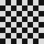
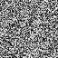
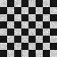

# Plugin: Hologram (`HologramSynthesizer`)

The **hologram** plugin synthesises a computer-generated hologram (CGH) from a
target image using the **Gerchberg–Saxton (GS) algorithm**.  The output is a
phase-only mask whose far-field diffraction pattern approximates the target
amplitude distribution.

## Algorithm

1. Start with unit-amplitude, random-phase near-field `H`.
2. FFT → far-field `F`.
3. Replace amplitude of `F` with the target amplitude; keep phase.
4. IFFT → updated near-field `H'`.
5. Replace amplitude of `H'` with 1 (unit aperture); keep phase.
6. Repeat from step 2 for the specified number of iterations.

The synthesised phase is then quantised to either binary (0/π) or continuous
greyscale (0–255 ≡ 0–2π).

## Parameters

| Parameter | Unit | Description |
|-----------|------|-------------|
| `targetImage` | — | Square grayscale `BufferedImage`, side must be a power of two (16–1024 px) |
| `iterations` | — | Number of GS iterations (30–100 is typical) |
| `outputType` | — | `BINARY_PHASE` (0/π → black/white) or `GREYSCALE_PHASE` (continuous) |
| `dpi` | dots/inch | Printer resolution (sets the physical pixel pitch) |

## Example images

### Synthetic checker target (64×64, 8 blocks)



The checker pattern is used as the target far-field amplitude distribution.

### Synthesised greyscale phase mask (50 GS iterations)



The continuous phase values (0–2π) are encoded as greyscale intensities.
When illuminated by a coherent plane wave, this mask reconstructs an
approximation of the checker target in the far field.

### Simulated optical reconstruction



The reconstruction is computed as |FFT(H)|² of the phase mask.
Residual speckle and artefacts are expected due to the finite number of
iterations.

## Java API

```java
// Prepare a target image (your own or the built-in helper)
BufferedImage target = HologramParameters.syntheticCheckerTarget(64, 8);

// Synthesise the hologram
HologramParameters p = new HologramParameters(
        target,
        50,                                          // GS iterations
        HologramParameters.OutputType.GREYSCALE_PHASE,
        1200.0                                       // DPI
);
RenderResult result = HologramSynthesizer.synthesize(p);
BufferedImage mask   = result.image();

// Simulate the optical reconstruction (|FFT(H)|²)
BufferedImage reconstruction = HologramSynthesizer.reconstruct(
        mask, HologramParameters.OutputType.GREYSCALE_PHASE);

// Deterministic synthesis with explicit RNG seed
RenderResult det = HologramSynthesizer.synthesize(p, 0xDEAD_BEEFL);
```

## Notes

- The default `synthesize(p)` overload uses a fixed internal seed, so it is
  **fully deterministic** across runs.
- The target image must be square and its side length must be a power of two
  (16, 32, 64, …, 1024).
- Reconstruction quality improves with more iterations but quickly plateaus
  after ~50–100 iterations for typical targets.

## Regenerating the example images

```bash
mvn -pl optics-core test -Dtest=PluginDocImagesTest#hologram_generateDocImages
```
