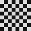
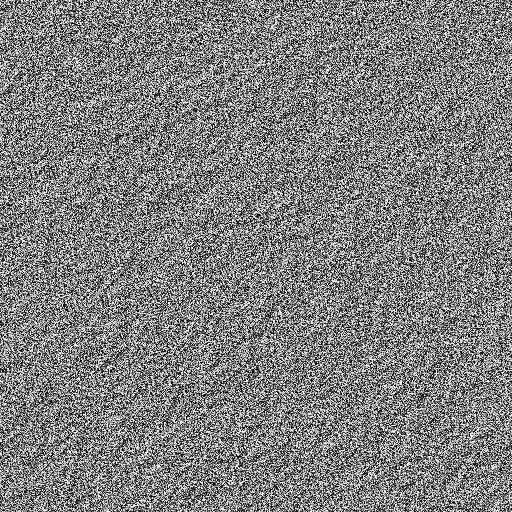
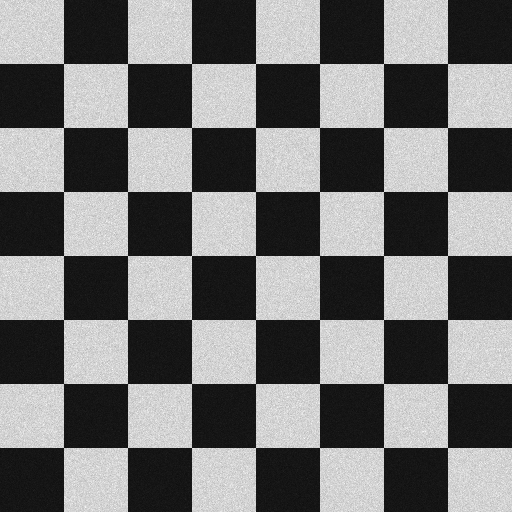

# Plugin: Hologram (`hologram`)

The **hologram** plugin synthesises a computer-generated hologram (CGH) from a
target image using the **Gerchberg–Saxton (GS) algorithm**. The output is a
phase-only mask whose far-field diffraction pattern approximates the target
amplitude distribution.

## Algorithm

1. Start with unit-amplitude, random-phase near-field `H`.
2. FFT → far-field `F`.
3. Replace amplitude of `F` with the target amplitude; keep phase.
4. IFFT → updated near-field `H'`.
5. Replace amplitude of `H'` with 1 (unit aperture); keep phase.
6. Repeat from step 2 for the specified number of iterations.

The synthesised phase is then quantised to either binary (0/π) or continuous
greyscale (0–255 ≡ 0–2π).

## Parameters

| Parameter | Unit | Description |
|-----------|------|-------------|
| `targetImageBase64` | — | Bounded, embedded PNG/JPEG source data; no network URL is fetched |
| `sidePx` | px | Square power-of-two synthesis grid (16–1024 px) |
| `iterations` | — | Number of GS iterations (30–100 is typical) |
| `outputType` | — | `BINARY_PHASE` or `GREYSCALE_PHASE` |
| `dpi` | dots/inch | Printer resolution (sets the physical pixel pitch) |
| `wavelengthNm` | nm | Fabrication wavelength used for phase-relief conversion |
| `refractiveIndexDelta` | — | Refractive-index difference between material and ambient |
| `maxPhaseShiftRad` | rad | Maximum phase shift represented by the relief |

## Reproducing the example

All three images below are declared outputs of one public production job:

[Download the checker Hologram job](../jobs/hologram/checker.fresnel)

Open the file with Fresnel to restore the embedded local target, the 512 × 512
synthesis grid and the exact iteration/fabrication parameters. The job does not
reference a remote asset and remains below the bounded `.fresnel` envelope limit.

<!-- fresnel-example:hologram/checker:start -->
| Parameter | Value |
|---|---:|
| Target image | Embedded data (1832 Base64 characters) |
| Side | 512 px |
| Gerchberg–Saxton iterations | 100 |
| Output type | Greyscale phase |
| Printer DPI | 1200 dpi |
| Fabrication wavelength | 550 nm |
| Refractive-index difference | 0.5 |
| Maximum phase shift | 6.283185307179586 rad |
<!-- fresnel-example:hologram/checker:end -->

## Example images

### Synthetic checker target (512 × 512, 8 blocks)



The checker pattern is the embedded target far-field amplitude distribution. Its
production output uses the bounded option:

```json
{ "hologramPng": "SOURCE" }
```

### Synthesised greyscale phase mask (100 GS iterations)



The continuous phase values (0–2π) are encoded as greyscale intensities. The
production output uses `MASK`, which is also the default when the option is
omitted.

### Simulated optical reconstruction



The reconstruction is computed as |FFT(H)|² of the generated phase mask. Its
production output uses:

```json
{ "hologramPng": "RECONSTRUCTION" }
```

Only `SOURCE`, `MASK` and `RECONSTRUCTION` are accepted. Unknown option fields or
values fail visibly; job data cannot select a class, script or arbitrary module.

## Java API

```java
// Prepare the same checker target as the documentation job.
BufferedImage target = HologramParameters.syntheticCheckerTarget(512, 8);

HologramParameters p = new HologramParameters(
        target,
        100,
        HologramParameters.OutputType.GREYSCALE_PHASE,
        1200.0
);
RenderResult result = HologramSynthesizer.synthesize(p);
BufferedImage mask = result.image();

BufferedImage reconstruction = HologramSynthesizer.reconstruct(
        mask, HologramParameters.OutputType.GREYSCALE_PHASE);

// Deterministic synthesis with an explicitly selected alternative seed.
RenderResult det = HologramSynthesizer.synthesize(p, 0xDEAD_BEEFL);
```

## Notes

- The default `synthesize(p)` overload uses a fixed internal seed, so it is
  deterministic across runs.
- The target grid side must be a power of two between 16 and 1024.
- Reconstruction quality improves with more iterations but usually plateaus after
  roughly 50–100 iterations for ordinary targets.
- Documentation hashing compares decoded PNG pixels and dimensions rather than
  encoder/compression bytes.

## Phase-relief STL export

The backend can also export a **closed STL mesh** through the Hologram API or a
canonical job output with format `stl`.

Conversion assumptions:

1. Greyscale 0…255 maps linearly to phase 0…`maxPhaseShiftRad` (default `2π`).
2. Optical path difference is `OPD = phase * λ / (2π)`.
3. Physical relief height is `h = OPD / Δn` where `Δn` is the refractive-index
   difference between print material and ambient medium.

Pixel pitch in the STL (`x/y`) follows the same `dpi` value used for hologram mask
generation. Synchronous STL export is capped at a 512-pixel side to bound memory.

## Reproducing and verifying the tracked images

```bash
bash packaging/docs-jobs.sh render \
  docs/jobs/hologram/checker.fresnel \
  docs/assets/plugins/hologram

bash packaging/docs-jobs.sh verify-manifest \
  docs/jobs docs/assets/plugins docs/generated/example-manifest.json
```
