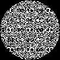
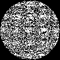

# Plugin: Multi-Focus Zone Plate (`MultiFocusRenderer`)

The **multi-focus** plugin divides the aperture of a zone plate among multiple
independent focal targets.  Each pixel is assigned to exactly one target via a
deterministic hash; the zone-plate phase for that pixel is then computed toward
its target.

This produces **N distinct focal spots** simultaneously from a single printed
element.  Common use cases:

- Two-point stereo illumination
- Scanning line projectors (line focus)
- Artistic multi-point illumination patterns

## Parameters

| Parameter | Unit | Description |
|-----------|------|-------------|
| `apertureDiameterMm` | mm | Aperture diameter of the combined element |
| `focusPoints` | list | List of `(x, y, z)` focus targets in mm; `z` is the focal distance |
| `wavelengthNm` | nm | Design wavelength |
| `dpi` | dots/inch | Printer resolution |
| `maskType` | — | `BINARY_AMPLITUDE` or `GREYSCALE_PHASE` |
| `polarity` | — | `POSITIVE` or `NEGATIVE` |

### Focus points

Each focus point is a record `FocusPoint(double xMm, double yMm, double zMm)` where
`(xMm, yMm)` is the transverse offset from the optical axis and `zMm` is the
axial focal distance (must be > 0).

For a line-focus design the helper `MultiFocusParameters.lineOfPoints(...)` creates
N equally-spaced points between two endpoints.

## Example images

### Two discrete foci (±3 mm off-axis, 300 mm focal distance)



The aperture is divided into two interleaved sub-apertures.  Each half focuses to
one of the two off-axis targets.

### Line focus (5 points, ±4 mm, 400 mm)



Five focus points distributed along a line produce an element that
illuminates a short horizontal line segment.

## Java API

```java
// Two discrete foci
MultiFocusParameters p = new MultiFocusParameters(
        10.0,  // aperture diameter, mm
        List.of(
                new MultiFocusParameters.FocusPoint(-3.0, 0.0, 300.0),
                new MultiFocusParameters.FocusPoint(+3.0, 0.0, 300.0)),
        550.0, 1200.0,
        MaskType.BINARY_AMPLITUDE, Polarity.POSITIVE);

RenderResult result = MultiFocusRenderer.render(p);

// Line focus (helper)
List<MultiFocusParameters.FocusPoint> line =
        MultiFocusParameters.lineOfPoints(
                -4, 0, 400,   // start (x, y, z) mm
                +4, 0, 400,   // end   (x, y, z) mm
                9             // number of points
        );
MultiFocusParameters lineFocusParams = new MultiFocusParameters(
        10.0, line, 550.0, 1200.0,
        MaskType.BINARY_AMPLITUDE, Polarity.POSITIVE);
```

## Regenerating the example images

```bash
mvn -pl optics-core test -Dtest=PluginDocImagesTest#multiFocus_generateDocImages
```
