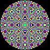

# Plugin: RGB Zone Plate (`RgbZonePlateRenderer`)

The **RGB zone plate** plugin renders the same aperture geometry at three
different design wavelengths (red, green, blue) and composites the results into
a single colour image.  It is useful for:

- Visualising the **chromatic aberration** of a zone plate (different focal
  lengths for different colours appear as colour fringing).
- Designing **colour-separated overlays** where each channel is printed on a
  different layer.

## Parameters

The renderer reuses all geometric parameters from
[`SingleZonePlateParameters`](zone-plate.md) (aperture, focal length, DPI,
off-axis target, mask type, polarity) and adds three wavelength overrides:

| Parameter | Unit | Description |
|-----------|------|-------------|
| `redNm` | nm | Design wavelength for the red channel (typical 630) |
| `greenNm` | nm | Design wavelength for the green channel (typical 532) |
| `blueNm` | nm | Design wavelength for the blue channel (typical 450) |

The `wavelengthNm` field of the base `SingleZonePlateParameters` record is
**ignored**; the three explicit channel wavelengths are used instead.

## Example image

### RGB composite (R=630 nm, G=532 nm, B=450 nm)



The colour fringing reveals that, for a given focal length, the zone radii differ
across wavelengths: zones are tighter for shorter (blue) wavelengths.

## Java API

```java
SingleZonePlateParameters base = SingleZonePlateParameters.onAxis(
        10.0,   // aperture diameter, mm
        1000.0, // focal length, mm
        550.0,  // ignored — channel wavelengths override this
        1200.0  // DPI
);

RenderResult result = RgbZonePlateRenderer.render(
        base,
        630.0, // red channel, nm
        532.0, // green channel, nm
        450.0  // blue channel, nm
);
BufferedImage rgbImage = result.image(); // TYPE_INT_RGB
```

## Regenerating the example images

```bash
mvn -pl optics-core test -Dtest=PluginDocImagesTest#rgbZonePlate_generateDocImages
```
