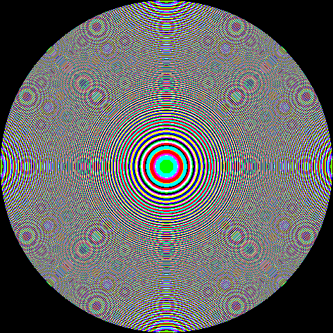

# Plugin: RGB Zone Plate (`rgb-zone-plate`)

The **RGB zone plate** plugin renders the same aperture geometry at three
different design wavelengths (red, green, blue) and composites the results into
a single colour image. It is useful for:

- Visualising the **chromatic aberration** of a zone plate (different focal
  lengths for different colours appear as colour fringing).
- Designing **colour-separated overlays** where each channel is printed on a
  different layer.

## Parameters

The renderer reuses all geometric parameters from the Zone Plate plugin
(aperture, focal length, DPI, off-axis target, mask type and polarity) and adds
three wavelength overrides:

| Parameter | Unit | Description |
|-----------|------|-------------|
| `redNm` | nm | Design wavelength for the red channel (typical 630) |
| `greenNm` | nm | Design wavelength for the green channel (typical 532) |
| `blueNm` | nm | Design wavelength for the blue channel (typical 450) |

The base `wavelengthNm` field is retained in the public parameter contract as a
reference value; the three explicit channel wavelengths drive RGB rendering.

## Example image

### RGB composite



[Download the source job](../jobs/rgb-zone-plate/rgb.fresnel)

<!-- fresnel-example:rgb-zone-plate/rgb:start -->
| Parameter | Value |
|---|---:|
| Aperture diameter | 10 mm |
| Focal length | 250 mm |
| Printer DPI | 1200 dpi |
| Red wavelength | 630 nm |
| Green wavelength | 532 nm |
| Blue wavelength | 450 nm |
| Reference wavelength | 550 nm |
| Target offset X | 0 mm |
| Target offset Y | 0 mm |
| Mask type | Binary amplitude |
| Polarity | Positive |
<!-- fresnel-example:rgb-zone-plate/rgb:end -->

The colour fringing reveals that, for a given focal length, the zone radii differ
across wavelengths: zones are tighter for shorter (blue) wavelengths. Opening
the job selects the RGB schema editor and restores both the nested base object and
the three channel values without translation.

## Java API

```java
SingleZonePlateParameters base = SingleZonePlateParameters.onAxis(
        10.0,  // aperture diameter, mm
        250.0, // focal length, mm
        550.0, // reference wavelength
        1200.0 // DPI
);

RenderResult result = RgbZonePlateRenderer.render(
        base,
        630.0, // red channel, nm
        532.0, // green channel, nm
        450.0  // blue channel, nm
);
BufferedImage rgbImage = result.image(); // TYPE_INT_RGB
```

## Reproducing and verifying the example

```bash
bash packaging/docs-jobs.sh render \
  docs/jobs/rgb-zone-plate/rgb.fresnel \
  docs/assets/plugins/rgb-zone-plate

bash packaging/docs-jobs.sh verify-manifest \
  docs/jobs docs/assets/plugins docs/generated/example-manifest.json
```
