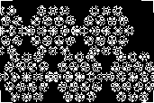

# Plugin: Window Foil (`WindowFoilRenderer`)

The **window foil** plugin renders a rectangular print sheet tiled with hexagonal
macro cells on a gap-less flat-top hex grid.  It is designed for creating
printable diffractive foils that can be applied to windows, lenses or flat
substrates to produce ambient light projections.

Each cell uses [Hex Macro Cell](hex-macro-cell.md) semantics.  Cells can share
a single focal specification or cycle through a list of focal lengths and target
offsets to create varied projection patterns.

Optional **crop marks** are drawn at sheet corners and at the top of each macro
cell to aid alignment after printing and cutting.

## Parameters

| Parameter | Unit | Description |
|-----------|------|-------------|
| `sheetWidthMm` | mm | Total sheet width |
| `sheetHeightMm` | mm | Total sheet height |
| `macroRadiusMm` | mm | Circumscribed radius of each hex macro cell |
| `subDiameterMm` | mm | Sub-element diameter within each cell |
| `subPitchMm` | mm | Sub-element lattice pitch (≥ `subDiameterMm`) |
| `wavelengthNm` | nm | Design wavelength |
| `dpi` | dots/inch | Printer resolution |
| `maskType` | — | `BINARY_AMPLITUDE` or `GREYSCALE_PHASE` |
| `polarity` | — | `POSITIVE` or `NEGATIVE` |
| `cellSpecs` | list | Per-cell focal length + target offset, cycled if shorter than cell count |
| `drawCropMarks` | bool | Draw thin crop marks on sheet corners and cell tops |

## Example image

### 60 mm × 40 mm foil sheet at 72 dpi with crop marks



Multiple hex macro cells tile the sheet gap-less.  Crop marks are visible at the
corners.

## Java API

```java
// Single focal length for all cells
WindowFoilParameters p = new WindowFoilParameters(
        120.0, 80.0,          // sheet size, mm
        15.0,                  // macro cell radius, mm
        5.0, 5.5,              // sub-element diameter / pitch, mm
        550.0,                 // wavelength, nm
        600.0,                 // DPI
        MaskType.BINARY_AMPLITUDE, Polarity.POSITIVE,
        List.of(WindowFoilParameters.CellSpec.onAxis(1000.0)),
        true                   // crop marks
);
RenderResult result = WindowFoilRenderer.render(p);

// Multiple focal lengths cycling across cells
List<WindowFoilParameters.CellSpec> specs = List.of(
        WindowFoilParameters.CellSpec.onAxis(500.0),
        new WindowFoilParameters.CellSpec(800.0, 2.0, 0.0), // off-axis
        WindowFoilParameters.CellSpec.onAxis(1200.0)
);
WindowFoilParameters pMulti = new WindowFoilParameters(
        120.0, 80.0, 15.0, 5.0, 5.5, 550.0, 600.0,
        MaskType.BINARY_AMPLITUDE, Polarity.POSITIVE,
        specs, false);

// Query cell count before rendering
int n = WindowFoilRenderer.countCells(p);
```

## Regenerating the example images

```bash
mvn -pl optics-core test -Dtest=PluginDocImagesTest#windowFoil_generateDocImages -Dfresnel.docs=generate
```
