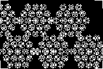

# Plugin: Window Foil (`window-foil`)

The **window foil** plugin renders a rectangular print sheet tiled with hexagonal
macro cells on a gap-less flat-top hex grid. It is designed for creating printable
diffractive foils that can be applied to windows, lenses or flat substrates to
produce ambient light projections.

Each cell uses [Hex Macro Cell](hex-macro-cell.md) semantics. Cells can share a
single focal specification or cycle through a list of focal lengths and target
offsets to create varied projection patterns.

Optional **crop marks** are drawn at sheet corners and at the top of each macro
cell to aid alignment after printing and cutting.

## Parameters

| Parameter | Unit | Description |
|-----------|------|-------------|
| `sheetWidthMm` | mm | Total sheet width |
| `sheetHeightMm` | mm | Total sheet height |
| `macroRadiusMm` | mm | Circumscribed radius of each hex macro cell |
| `subDiameterMm` | mm | Sub-element diameter within each cell |
| `subPitchMm` | mm | Sub-element lattice pitch (≥ `subDiameterMm`) |
| `wavelengthNm` | nm | Design wavelength |
| `dpi` | dots/inch | Printer resolution |
| `maskType` | — | `BINARY_AMPLITUDE` or `GREYSCALE_PHASE` |
| `polarity` | — | `POSITIVE` or `NEGATIVE` |
| `cellSpecs` | list | Per-cell focal length + target offset, cycled if shorter than cell count |
| `drawCropMarks` | bool | Draw thin crop marks on sheet corners and cell tops |

## Example image

### 60 mm × 40 mm foil sheet at 200 dpi with crop marks



[Download the source job](../jobs/window-foil/foil-sheet.fresnel)

<!-- fresnel-example:window-foil/foil-sheet:start -->
| Parameter | Value |
|---|---:|
| Sheet width | 60 mm |
| Sheet height | 40 mm |
| Macro radius | 12 mm |
| Sub-element diameter | 4 mm |
| Sub-element pitch | 4.5 mm |
| Wavelength | 550 nm |
| Printer DPI | 200 dpi |
| Mask type | Binary amplitude |
| Polarity | Positive |
| Draw crop marks | Yes |
| Cell specifications | 1. Focal length = 1000 mm, Target offset X = 0 mm, Target offset Y = 0 mm |
<!-- fresnel-example:window-foil/foil-sheet:end -->

Multiple hex macro cells tile the sheet gap-less. Crop marks are visible at the
corners. Opening the job restores the exact per-cell list in the trusted layout
widget.

Window Foil now advertises both PNG and PDF production capabilities. The PNG
button in the schema-driven action bar uses the same renderer as this public job;
the PDF action retains its sheet-size selector.

## Java API

```java
// Single focal length for all cells, matching the documentation job
WindowFoilParameters p = new WindowFoilParameters(
        60.0, 40.0,           // sheet size, mm
        12.0,                  // macro cell radius, mm
        4.0, 4.5,              // sub-element diameter / pitch, mm
        550.0,                 // wavelength, nm
        200.0,                 // DPI
        MaskType.BINARY_AMPLITUDE, Polarity.POSITIVE,
        List.of(WindowFoilParameters.CellSpec.onAxis(1000.0)),
        true                   // crop marks
);
RenderResult result = WindowFoilRenderer.render(p);

// Multiple focal lengths cycling across cells
List<WindowFoilParameters.CellSpec> specs = List.of(
        WindowFoilParameters.CellSpec.onAxis(500.0),
        new WindowFoilParameters.CellSpec(800.0, 2.0, 0.0), // off-axis
        WindowFoilParameters.CellSpec.onAxis(1200.0)
);
WindowFoilParameters pMulti = new WindowFoilParameters(
        120.0, 80.0, 15.0, 5.0, 5.5, 550.0, 600.0,
        MaskType.BINARY_AMPLITUDE, Polarity.POSITIVE,
        specs, false);

// Query cell count before rendering
int n = WindowFoilRenderer.countCells(p);
```

## Reproducing and verifying the example

```bash
bash packaging/docs-jobs.sh render \
  docs/jobs/window-foil/foil-sheet.fresnel \
  docs/assets/plugins/window-foil

bash packaging/docs-jobs.sh verify-manifest \
  docs/jobs docs/assets/plugins docs/generated/example-manifest.json
```
