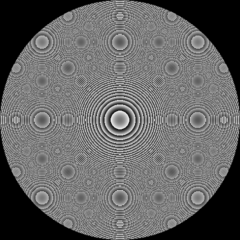
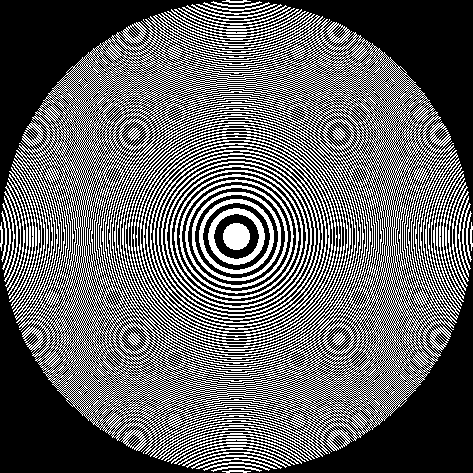

# Plugin: Zone Plate (`ZonePlateRenderer`)

A **Fresnel zone plate** is a diffractive optical element that focuses light by
alternately blocking or shifting the phase of concentric ring zones. This plugin
computes the binary amplitude or greyscale phase mask for a single, rotationally
symmetric (on-axis) or off-axis zone plate.

## Parameters

| Parameter | Unit | Description |
|-----------|------|-------------|
| `apertureDiameterMm` | mm | Outer diameter of the zone plate |
| `focalLengthMm` | mm | Design focal length (z-distance to image plane) |
| `wavelengthNm` | nm | Design wavelength |
| `dpi` | dots/inch | Printer / plotter resolution |
| `targetOffsetXmm` | mm | Off-axis target shift in X (0 = on-axis) |
| `targetOffsetYmm` | mm | Off-axis target shift in Y (0 = on-axis) |
| `maskType` | — | `BINARY_AMPLITUDE` or `GREYSCALE_PHASE` |
| `polarity` | — | `POSITIVE` (transparent zones) or `NEGATIVE` (inverted) |

## Mask types

| Type | Description |
|------|-------------|
| `BINARY_AMPLITUDE` | Classic zone plate: opaque and transparent rings. Theoretically ~10 % first-order efficiency. |
| `GREYSCALE_PHASE` | Continuous phase ramp (0–2π mapped to 0–255). Theoretically ~40 % first-order efficiency. |

## Example images

### On-axis, binary amplitude, positive polarity


Typical Fresnel zone plate: the innermost zone is transparent; successive zones
alternate opaque / transparent.

### Greyscale phase mask



Continuous greyscale encoding of the phase 0…2π.  Brighter pixels correspond to
a larger phase shift.

### Negative polarity (inverted binary amplitude)



Every transparent zone becomes opaque and vice versa.  The first-order focal spot
is the same; only the zero-order background changes.

## Optical quality report

Calling `DesignValidator.validate(p)` (or the `/api/designs/validate` REST endpoint)
returns an `OpticalQualityReport` alongside the printability metrics.

### Fields and formulas

All formulas assume a paraxial diffractive optic working in air (n = 1).

| Field | Unit | Formula |
|-------|------|---------|
| `wavelengthNm` | nm | design wavelength (input) |
| `focalLengthMm` | mm | design focal length (input) |
| `apertureDiameterMm` | mm | aperture diameter (input) |
| `numericalAperture` | — | `NA = D / (2·f)` |
| `fNumber` | — | `F# = f / D` |
| `airyDiskDiameterMicrons` | µm | `d_Airy = 2.44·λ·F#` — diameter to first dark ring |
| `rayleighAngularResolutionRad` | rad | `θ_R = 1.22·λ/D` — classical Rayleigh criterion |
| `depthOfFocusMicrons` | µm | `DoF = 2·λ·F#²` — ±1λ wave-front-error criterion |
| `outermostZoneWidthMicrons` | µm | `Δr = λ·f/D` — paraxial outer zone approximation |
| `chromaticFocalShiftMm` | mm | `Δf = f·λ·(1/λ_min − 1/λ_max)` — from f(λ) ∝ 1/λ |
| `chromaticRangeMinNm` | nm | lower bound of chromatic shift estimate (default 450) |
| `chromaticRangeMaxNm` | nm | upper bound of chromatic shift estimate (default 650) |

### Java API

```java
SingleZonePlateParameters p = SingleZonePlateParameters.onAxis(10.0, 1000.0, 550.0, 1200.0);

// Default visible range (450–650 nm)
OpticalQualityReport report = DesignValidator.computeOpticalQualityReport(p);

// Custom wavelength range
OpticalQualityReport report2 = DesignValidator.computeOpticalQualityReport(p, 500.0, 600.0);

System.out.println("NA = "  + report.numericalAperture());
System.out.println("F# = "  + report.fNumber());
System.out.println("Airy disk = " + report.airyDiskDiameterMicrons() + " µm");
```


```java
// On-axis convenience constructor
SingleZonePlateParameters p = SingleZonePlateParameters.onAxis(
        10.0,   // aperture diameter, mm
        1000.0, // focal length, mm
        550.0,  // wavelength, nm
        1200.0  // DPI
);
RenderResult result = ZonePlateRenderer.render(p);
BufferedImage image  = result.image();
double pixelMm       = result.pixelSizeMm();

// Full constructor with off-axis target and greyscale phase
SingleZonePlateParameters p2 = new SingleZonePlateParameters(
        10.0, 1000.0, 550.0, 1200.0,
        2.0, 0.0,                          // target offset X/Y (mm)
        MaskType.GREYSCALE_PHASE,
        Polarity.POSITIVE
);
```

## Regenerating the example images

```bash
mvn -pl optics-core test -Dtest=PluginDocImagesTest#zonePlate_generateDocImages -Dfresnel.docs=generate
```
