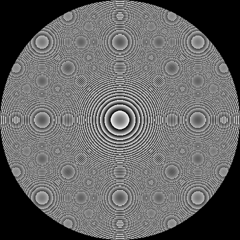
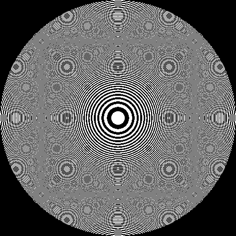

# Plugin: Zone Plate (`zone-plate`)

A **Fresnel zone plate** is a diffractive optical element that focuses light by
alternately blocking or shifting the phase of concentric ring zones. This plugin
computes the binary amplitude or greyscale phase mask for a single, rotationally
symmetric (on-axis) or off-axis zone plate.

## Parameters

| Parameter | Unit | Description |
|-----------|------|-------------|
| `apertureDiameterMm` | mm | Outer diameter of the zone plate |
| `focalLengthMm` | mm | Design focal length (z-distance to image plane) |
| `wavelengthNm` | nm | Design wavelength |
| `dpi` | dots/inch | Printer / plotter resolution |
| `targetOffsetXmm` | mm | Off-axis target shift in X (0 = on-axis) |
| `targetOffsetYmm` | mm | Off-axis target shift in Y (0 = on-axis) |
| `maskType` | — | `BINARY_AMPLITUDE` or `GREYSCALE_PHASE` |
| `polarity` | — | `POSITIVE` (transparent zones) or `NEGATIVE` (inverted) |

## Mask types

| Type | Description |
|------|-------------|
| `BINARY_AMPLITUDE` | Classic zone plate: opaque and transparent rings. Theoretically ~10 % first-order efficiency. |
| `GREYSCALE_PHASE` | Continuous phase ramp (0–2π mapped to 0–255). Theoretically ~40 % first-order efficiency. |

## Reproducing the examples in Fresnel

Each generated image below has exactly one checked-in `.fresnel` production job.
The job is the source; the image, GUI and verification tooling are consumers.

1. Download the linked `.fresnel` file.
2. Open it with an installed Fresnel application, or use **Open job…** in the web UI.
3. Fresnel selects the `zone-plate` editor and restores the normalized parameters.
4. Render, modify or export the design through the same schema-driven editor used
   for ordinary work.

Opening the downloaded file through a native Windows or Linux installation uses
the registered file association. No documentation-specific editor or remote URL
importer is involved.

## Example images

### On-axis, binary amplitude, positive polarity


[Download the source job](../jobs/zone-plate/on-axis.fresnel)

<!-- fresnel-example:zone-plate/on-axis:start -->
| Parameter | Value |
|---|---:|
| Aperture diameter | 10 mm |
| Focal length | 250 mm |
| Wavelength | 550 nm |
| Target offset X | 0 mm |
| Target offset Y | 0 mm |
| Printer DPI | 1200 dpi |
| Mask type | Binary amplitude |
| Polarity | Positive |
<!-- fresnel-example:zone-plate/on-axis:end -->

Typical Fresnel zone plate: the innermost zone is transparent; successive zones
alternate opaque / transparent.

### Greyscale phase mask



[Download the source job](../jobs/zone-plate/greyscale-phase.fresnel)

<!-- fresnel-example:zone-plate/greyscale-phase:start -->
| Parameter | Value |
|---|---:|
| Aperture diameter | 10 mm |
| Focal length | 250 mm |
| Wavelength | 550 nm |
| Target offset X | 0 mm |
| Target offset Y | 0 mm |
| Printer DPI | 1200 dpi |
| Mask type | Greyscale phase |
| Polarity | Positive |
<!-- fresnel-example:zone-plate/greyscale-phase:end -->

Continuous greyscale encoding of the phase 0…2π. Brighter pixels correspond to
a larger phase shift.

### Negative polarity (inverted binary amplitude)



[Download the source job](../jobs/zone-plate/negative-polarity.fresnel)

<!-- fresnel-example:zone-plate/negative-polarity:start -->
| Parameter | Value |
|---|---:|
| Aperture diameter | 10 mm |
| Focal length | 250 mm |
| Wavelength | 550 nm |
| Target offset X | 0 mm |
| Target offset Y | 0 mm |
| Printer DPI | 1200 dpi |
| Mask type | Binary amplitude |
| Polarity | Negative (inverted) |
<!-- fresnel-example:zone-plate/negative-polarity:end -->

Every transparent zone becomes opaque and vice versa. The first-order focal spot
is the same; only the zero-order background changes.

## Validation workflow

Zone plate designs support two deterministic validation surfaces:

- `POST /api/designs/validate` (legacy single-zone response as `ValidationResponse`)
- `POST /api/designs/zone-plate/validation` (zone-plate instance of the
  shared plugin validation route `POST /api/designs/{pluginId}/validation`,
  returning `DesignValidationReport`)

Both include optical and printability signals with explicit units and assumptions.
The plugin-independent report additionally keeps validation layers/finding semantics
consistent with the experimental workflow and export payloads.

### Optical quality fields and formulas

All formulas assume a paraxial diffractive optic working in air (n = 1).

| Field | Unit | Formula |
|-------|------|---------|
| `wavelengthNm` | nm | design wavelength (input) |
| `focalLengthMm` | mm | design focal length (input) |
| `apertureDiameterMm` | mm | aperture diameter (input) |
| `numericalAperture` | — | `NA = D / (2·f)` |
| `fNumber` | — | `F# = f / D` |
| `airyDiskDiameterMicrons` | µm | `d_Airy = 2.44·λ·F#` — diameter to first dark ring |
| `rayleighAngularResolutionRad` | rad | `θ_R = 1.22·λ/D` — classical Rayleigh criterion |
| `depthOfFocusMicrons` | µm | `DoF = 2·λ·F#²` — ±1λ wave-front-error criterion |
| `outermostZoneWidthMicrons` | µm | `Δr = λ·f/D` — paraxial outer zone approximation |
| `chromaticFocalShiftMm` | mm | `Δf = f·λ·(1/λ_min − 1/λ_max)` — from f(λ) ∝ 1/λ |
| `chromaticRangeMinNm` | nm | lower bound of chromatic shift estimate (default 450) |
| `chromaticRangeMaxNm` | nm | upper bound of chromatic shift estimate (default 650) |

### Java API

```java
SingleZonePlateParameters p = SingleZonePlateParameters.onAxis(10.0, 1000.0, 550.0, 1200.0);

// Default visible range (450–650 nm)
OpticalQualityReport report = DesignValidator.computeOpticalQualityReport(p);

// Custom wavelength range
OpticalQualityReport report2 = DesignValidator.computeOpticalQualityReport(p, 500.0, 600.0);

System.out.println("NA = "  + report.numericalAperture());
System.out.println("F# = "  + report.fNumber());
System.out.println("Airy disk = " + report.airyDiskDiameterMicrons() + " µm");
```

```java
// On-axis convenience constructor
SingleZonePlateParameters p = SingleZonePlateParameters.onAxis(
        10.0,   // aperture diameter, mm
        1000.0, // focal length, mm
        550.0,  // wavelength, nm
        1200.0  // DPI
);
RenderResult result = ZonePlateRenderer.render(p);
BufferedImage image  = result.image();
double pixelMm       = result.pixelSizeMm();

// Full constructor with off-axis target and greyscale phase
SingleZonePlateParameters p2 = new SingleZonePlateParameters(
        10.0, 1000.0, 550.0, 1200.0,
        2.0, 0.0,                          // target offset X/Y (mm)
        MaskType.GREYSCALE_PHASE,
        Polarity.POSITIVE
);
```

## Verifying or regenerating documentation artifacts

The documentation command consumes the public jobs through `FresnelJobExecutor`;
it does not invoke or name a JUnit image generator.

```bash
# Render all discovered jobs into their plugin asset directories.
bash packaging/docs-jobs.sh render-all docs/jobs docs/assets/plugins

# Side-effect-free CI/developer verification against checked-in assets.
bash packaging/docs-jobs.sh verify-all docs/jobs docs/assets/plugins

# Inspect the discovered job/plugin/output mapping.
bash packaging/docs-jobs.sh list docs/jobs

# Print the schema-derived parameter table for one job.
bash packaging/docs-jobs.sh table docs/jobs/zone-plate/on-axis.fresnel
```

PNG verification compares decoded pixels, dimensions and intended DPI rather than
compressed PNG bytes. Encoder/compression changes therefore do not create false
staleness failures when the visible and physical output is unchanged.

## Print calibration sheet

Before printing optical masks, download **Calibration PDF** from the Zone Plate panel.
The sheet contains:

- 0–100 mm scale bar
- centring cross and corner registration marks
- DPI/pixel-pitch stripe fields
- 1–4 px line-space targets
- density patches and circular aperture references
- metadata line with intended DPI and print scale

Always print at **100% / actual size** (disable fit-to-page).

### Interpreting common print errors

| Observation | Likely cause |
|---|---|
| Scale bar too short/long | driver or viewer scaling not at 100% |
| Horizontal and vertical scales differ | non-uniform scaling in print pipeline |
| 1 px / 2 px fields blur together | printer/material cannot resolve requested DPI |
| Corner marks offset between passes | registration/feed alignment error |
| Filled patch looks streaky or porous | insufficient density/ink or uneven toner transfer |
